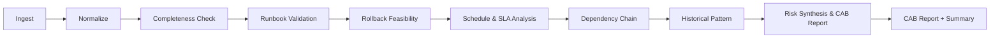

# ITSM Change Request Analyzer — Architecture

## Overview

A sequential 9-stage pipeline that pre-analyzes IT change requests for the Change Advisory Board by cross-referencing ITSM records, runbooks, rollback plans, CMDB state, SLA definitions, scheduling data, and incident history. Uses the **minimum capable component** principle: script/graph for deterministic operations (completeness checks, schedule overlap, dependency DAG, historical pattern matching), NLP/encoder where structure extraction from prose is needed (runbook service-reference parsing, rollback action classification), LLM only where natural-language reasoning or narrative synthesis is unavoidable (CAB risk narrative at L2+). Orchestrated as a sequential 9-stage runner with disk checkpoints per stage (`ingest.json` … `cab-report.json`), supporting resume-from-stage for development iteration and batch processing over CAB windows (multi-CR inputs).

**Agent Score:** 23/25 (H=5, O=5, E=5, N=4, C=4) | **Eval Readiness:** ★★★½ | **Total:** 26/35

---

## Input / Output Schema

**Input — CR Bundle (per change request):**

| Field | Format | Required | Description |
|-------|--------|----------|-------------|
| `itsm_record` | JSON | **yes** | Change ID, type (standard/normal/emergency), risk category (low/medium/high), title, description, affected services, requestor, approvers, scheduled window start/end, expected duration |
| `runbook` | Markdown | nullable | Numbered procedural steps referencing services, endpoints, commands; authored pre-change. **Absent in BPI 2014 and most public datasets — stage 4 skips when null.** |
| `rollback_plan` | Markdown | nullable | Revert steps, assumptions, estimated duration, data-loss window assessment. **Absent in BPI 2014 — stage 5 skips when null.** |
| `cmdb_snapshot` | JSON | nullable | Service graph: nodes `{id, name, type, status, version, tier}`, edges `{source, target, relation}`. **Absent in BPI 2014 — stage 7 skips when null.** |
| `sla_definitions` | JSON | nullable | Per-service-tier: `{tier, monthly_downtime_budget_min, consumed_this_month_min, measurement_window}`. **97% missing in BPI 2014 — stage 6 degrades to overlap-only.** |
| `maintenance_schedule` | JSON | nullable | All CRs in the same CAB window: `[{change_id, scheduled_start, scheduled_end, affected_services, expected_duration_min}]` |
| `communication_plan` | Markdown | nullable | Customer notification template, internal stakeholder alerts, escalation contacts |
| `incident_history` | JSON | nullable | Past incidents linked to service + change category: `[{incident_id, service, change_category, severity, root_cause_summary, date}]` |
| `pr_scope_flags` | JSON | nullable | Optional CI/CD metadata: `{schema_migration: bool, customer_facing_api: bool, data_backfill: bool, test_coverage_delta: float}` — scope signals only, no diff analysis (that's #4.5 Change Window Risk Analyzer's job — see [#4.5 Complementarity](#45-complementarity) below) |

- Size range: 10K-50K characters per CR bundle (3K-12K tokens)
- Batch input: array of CR bundles for a single CAB window (typically 5-50 CRs)

**Output — Per-CR Risk Assessment:**

| Field | Format | Description |
|-------|--------|-------------|
| `change_risk_assessment.json` | JSON | CR ID, overall risk level (low/medium/high/critical), CAB recommendation (approve/conditional/reject), per-dimension findings array |
| `change_risk_assessment.md` | Markdown | Human-readable version: executive summary, per-dimension findings with severity/evidence/remediation, CAB recommendation with reasoning |

Per-dimension finding schema:
```
{dimension, severity [blocker|warning|info], finding, evidence: {artifact, location}, remediation}
```

Assessment dimensions: (1) runbook validity, (2) rollback feasibility, (3) scheduling conflicts, (4) communication gaps, (5) dependency chain issues, (6) SLA impact, (7) completeness gaps, (8) historical pattern alerts.

**Output — CAB Window Summary:**

| Field | Format | Description |
|-------|--------|-------------|
| `cab-summary.json` | JSON | Total CRs analyzed, disposition breakdown (approve/conditional/reject counts), cross-CR conflicts list, aggregate SLA impact per tier, processing time, cost |
| `cab-summary.md` | Markdown | Rendered summary for CAB chair: top risks, conflict map, SLA budget dashboard |

Per-stage JSON artifacts: `ingest.json`, `normalize.json`, `completeness.json`, `runbook-validate.json`, `rollback-assess.json`, `schedule-sla.json`, `dependency-chain.json`, `historical-pattern.json`, `cab-report.json`

### Constraints

| Constraint | Detail |
|------------|--------|
| **Real-first + synthetic regression** | P0 development uses BPI Challenge 2014 real ITIL change records as primary dataset (partial bundles, stages degrade gracefully). Synthetic fixtures (`fixtures/cab-window-01/`) serve as regression tests for full-bundle paths. No production ITSM data. |
| **No external ITSM API dependency** | Vendor-neutral JSON schema. No ServiceNow/BMC/Jira SM API integration at P0. Production adapters are P2 scope. |
| **LLM stages use generator fixtures** | L2+ stages that invoke LLM use synthetic test cases from the CR generator. No production ITSM data to LLM APIs. |
| **No code-level semantic analysis** | PR/diff is scope-context only (boolean flags). Cross-PR conflict detection belongs to #4.5 Change Window Risk Analyzer. |
| **Enterprise partner required for P2** | Real-path validation (false-positive rate on real CRs, CAB recommendation accuracy vs expert) requires enterprise partnership. Commercial claims blocked until P2. |

### #4.5 Complementarity

The ITSM CR Analyzer (#19b) and Change Window Risk Analyzer (#4.5) are complementary, not overlapping:

| Dimension | #19b ITSM CR Analyzer | #4.5 Change Window Risk |
|-----------|----------------------|------------------------|
| **Core question** | "Is the operational plan for this change sound?" | "Will these code changes break each other technically?" |
| **Input artifacts** | ITSM record, runbook, rollback plan, CMDB, SLA, schedule, comms, incident history | PR diffs, API schemas, deployment configs, CI/CD pipeline definitions |
| **Scheduling scope** | Operational: overlapping windows on shared infra, SLA budget arithmetic, dependency ordering | Technical: deploy sequencing, rollback ordering based on code dependencies |
| **Runbook scope** | Contextual validity: does THIS runbook match CURRENT system state for THIS change? | Out of scope |
| **Code analysis** | None (accepts scope flags only) | Full diff semantic analysis, AST-level conflict detection |

**Boundary rule:** #19b reads operational artifacts; #4.5 reads code artifacts. If both experiments mature, a shared "CAB window context" JSON schema can bridge them — #19b produces operational risk, #4.5 produces technical risk, CAB chair sees both.

---

## Datasets & Ground Truth

**GT Alignment legend:** **Direct** = maps to pipeline output, usable as-is. **Partial** = labels exist but need adaptation to match pipeline schema. **None** = no annotations, input-only.

### Primary Dataset

| Source | Role | Type | Size | Access | GT Alignment | Pipeline stages | What it covers / gaps |
|--------|------|------|------|--------|:------------:|-----------------|----------------------|
| [BPI Challenge 2014](https://data.4tu.nl/datasets/e9c00fe9-c87a-450e-8bd6-d5e06a6b309a) (Rabobank) | **Primary** | **Real** | 18K unique changes, 46K incidents (CSV) | Free (4TU.ResearchData) | **Partial** | Ingest, Normalize, Completeness Check, Schedule & SLA (overlap-only), Historical Pattern, Risk Synthesis | **Primary P0/P1 dataset.** Real ITIL change records (HP Service Manager). 56 recurring (CI, ChangeType) tuples = natural GT for Historical Pattern; 25K schedule overlaps. No runbooks/rollback/comms — stages 4–5 skip; 97% missing Scheduled Downtime → stage 6 degraded (see spike). |
| Synthetic CR Generator | **Supplementary** | Synthetic | 200+ CRs (160+ with injected failures, 40+ clean) | Script in repo | **Direct** | All 9 stages (full bundles) | **Regression / prose GT path.** `fixtures/cab-window-01/` is the integration fixture. Injected failures provide definitional GT for runbook, rollback, and completeness dimensions synthetic-only data can cover. **Limitation:** ITIL-template clean; upper bound on production performance. |

### Generator Design

**Taxonomy:**
- Change types: standard (pre-approved, low risk), normal (CAB review required), emergency (expedited approval)
- Risk categories: low, medium, high (mapped to ITIL risk matrix)
- CAB window groupings: 5-15 CRs per window for scheduling/dependency eval

**Artifact templates:**
- ITSM record: ServiceNow-shaped JSON with vendor-neutral field names
- Runbook: Markdown with numbered procedural steps, service references, command examples
- Rollback plan: Markdown with revert procedure, assumptions, duration estimate
- CMDB snapshot: JSON service graph (nodes + edges) with versioned state
- SLA definitions: JSON per-tier monthly downtime budgets
- Maintenance schedule: JSON array of all CRs in the CAB window
- Communication plan: Markdown stub (customer notification, stakeholder alerts)
- Incident history: JSON index of past incidents by service + change category
- PR scope flags: optional JSON with boolean scope signals

**Injection taxonomy (8 failure types = definitional GT):**

| # | Failure type | What's injected | Which stage detects it |
|---|-------------|-----------------|----------------------|
| 1 | Stale runbook reference | Runbook references service marked `deprecated` in CMDB | Runbook Validation |
| 2 | Infeasible rollback | "Restore backup" plan for irreversible schema migration | Rollback Feasibility |
| 3 | Scheduling overlap | Two CRs on shared infrastructure with overlapping windows | Schedule & SLA Analysis |
| 4 | SLA budget exceeded | Combined maintenance exceeds monthly downtime budget | Schedule & SLA Analysis |
| 5 | Missing dependency ordering | Downstream CR scheduled before upstream prerequisite | Dependency Chain |
| 6 | Incomplete communication | Customer-facing scope change with no communication plan | Completeness Check (via Normalize tier flag) |
| 7 | Historical incident pattern | Same (service, change_category) tuple with ≥2 past P1/P2 incidents | Historical Pattern |
| 8 | Missing mandatory fields | No rollback plan, no runbook, or no risk assessment | Completeness Check |

**Volume targets:**
- 20+ CRs per single-failure type = 160+ single-injection CRs
- Multi-label CRs (2-3 simultaneous failures): 30+ for E2E difficulty
- 30+ multi-CR CAB windows for stages 6-7 (cross-CR evaluation)
- 40+ clean CRs (unmodified baseline) for false-positive measurement
- Total: 200+ CRs, generator seeds reproducible (fixed seed) for regression

**Realism knobs (decisions deferred to skeptic review):**
- Prose messiness: template-clean ITIL vs enterprise-sloppy (abbreviations, incomplete sentences)
- Noise injection: randomly omit optional fields, add irrelevant ITSM boilerplate
- CMDB staleness: percentage of services with version drift between runbook authoring and current snapshot

### Real / Process Mining Datasets (P1)

| Source | Type | Size | Access | GT Alignment | Pipeline stages | What it covers / gaps |
|--------|------|------|--------|:------------:|-----------------|----------------------|
| [BPI Challenge 2014](https://data.4tu.nl/datasets/e9c00fe9-c87a-450e-8bd6-d5e06a6b309a) (Rabobank) | **Real** | Change details CSV + incident/activity logs | Free (4TU.ResearchData) | **Partial** | Ingest, Normalize, Historical Pattern, Schedule & SLA Analysis | **Most relevant real dataset.** ITIL change records from a major bank (HP Service Manager). Change→incident linkage enables historical pattern validation. No runbooks/rollback plans — tests structured-field pipeline only. |
| [UCI Incident Management](https://archive.ics.uci.edu/dataset/498/) | **Real** | 24,918 incidents, 141,712 events, 36 attributes | Free (UCI ML Repository) | Partial | Historical Pattern | ServiceNow-extracted incident process log. No change records directly, but incident history index can be validated against real incident patterns. Anonymized. |
| [ServiceNow-AI/EnterpriseOps-Gym](https://huggingface.co/datasets/ServiceNow-AI/EnterpriseOps-Gym) | Synthetic benchmark | 181 ITSM tasks, containerized MCP servers | Free (HuggingFace) | Partial | Pipeline-wide (agentic benchmark) | ServiceNow's official enterprise ops benchmark (2026). Evaluates LLM agents on multi-step ITSM planning with SQL verifiers. Different eval paradigm (action-based, not finding-based) but useful for agent-comparison baselines. |
| [ServiceNow-itsm-safety-bench](https://github.com/ServiceNow/ServiceNow-itsm-safety-bench) | Seed data | 10 change_requests, 50 incidents, 20 CMDB items | Free (GitHub) | Partial | Ingest, Normalize, Completeness Check | ServiceNow instance snapshot with change + CMDB structure. Small but validates vendor-neutral schema mapping. Safety-focused scenarios (approval bypass, record manipulation). |
| [VuduVations/itsm-change-management-benchmark](https://huggingface.co/datasets/VuduVations/itsm-change-management-benchmark) | Synthetic benchmark | 15 incidents, 68 CMDB items, 3 CAB scenarios | Free (HuggingFace) | Partial | Risk Synthesis & CAB Report | First public change management benchmark for CAB evaluation. Small but includes RFC→CAB scoring pipeline. Useful for Report stage comparison. |
| ArXiv 2604.13462 (international bank, 2026) | Paper (proprietary data) | 175K change tickets (1 year) + incident linkage | Paper only (data not public) | None | — | Predictive incident risk scoring for change management using ML. Validates that our problem formulation matches real enterprise practice. **Reference architecture**, not usable data. |

### Reference Sources

| Source | Type | Access | GT Alignment | Purpose |
|--------|------|--------|:------------:|---------|
| [Scoutflo SRE Playbooks](https://github.com/Scoutflo/Scoutflo-SRE-Playbooks) | Real runbooks | Free (GitHub, 414 playbooks: 232 K8s + 157 AWS + 25 Sentry) | None | **Runbook prose templates.** Real operational runbooks with procedural steps, service references, diagnostic commands. Not paired with change requests, but provides realistic prose structure for generator templates instead of invented runbook text. |
| [KubePlaybook](https://github.com/K8sPlayBook/KubePlaybook) (IBM Research) | Real playbooks | Free (GitHub, 130 Ansible playbooks + NL prompts) | None | Ansible remediation playbooks with natural language descriptions. Useful for rollback plan prose patterns — Ansible playbook structure mirrors rollback procedural steps. |
| ITIL certification case studies | Reference | Proprietary (sanitized) | None | Format reference for generator template diversity. NOT evaluation GT — too clean and idealized. |
| ServiceNow community examples | Reference | Public (community forums) | None | Field naming conventions and workflow structure for realistic CR templates. Input diversity only. |
| BMC Remedy documentation | Reference | Public (vendor docs) | None | Alternative ITSM field patterns for vendor-neutral schema validation. |

### Ground Truth Coverage by Stage

| Stage | Direct GT? | Best source | Gap |
|-------|:----------:|-------------|-----|
| Ingest | No | Synthetic CRs (structure consistency) | No parsing GT. Evaluate via downstream stage quality — if Normalize fails, Ingest may be the bottleneck. |
| Normalize | No | — | No GT. Evaluate via cross-CR output consistency (field presence rate >99% on required fields). |
| Completeness Check | **Direct** | Injected failures #6 (missing comms) + #8 (missing fields) | Completeness rules are deterministic against ITIL checklist. GT = which fields are missing. |
| Runbook Validation | **Direct** | Injected failure #1 (stale runbook reference) | CMDB-vs-runbook cross-reference. GT = which runbook steps reference deprecated/missing services. |
| Rollback Feasibility | **Direct** | Injected failure #2 (infeasible rollback) | Rollback plan vs change scope. GT = whether rollback actions are feasible given the change type. |
| Schedule & SLA Analysis | **Direct** | Injected failures #3 (overlap) + #4 (SLA exceeded) | Cross-CR scheduling data. GT = which CR pairs overlap and cumulative downtime calculation. |
| Dependency Chain | **Direct** | Injected failure #5 (dependency inversion) | CMDB service graph + schedule ordering. GT = prerequisite violations in CR ordering. |
| Historical Pattern | **Direct** | Injected failure #7 (incident pattern match) | Incident history index. GT = which (service, change_category) tuples have high prior failure rates. |
| Risk Synthesis & CAB Report | Partial | Derived from per-stage GT labels | CAB recommendation GT = deterministic rule from per-dimension severity rollup. Evidence citation quality has no GT — proxy via completeness count. |

### Ground Truth Strategy

**P0 — Synthetic injection (no annotation cost, primary eval path):**
1. Generate 200+ CR bundles with ITIL-template generator → inject 8 failure types (20+ each) → run pipeline → measure per-dimension recall/precision.
2. Run Schedule & SLA Analysis and Dependency Chain on multi-CR CAB windows → measure cross-CR conflict detection accuracy.
3. Run full pipeline on 40+ clean CRs → measure false-positive rate per dimension.
4. CAB rollup self-consistency: 3-class accuracy (approve/conditional/reject) against GT labels derived from injected severity rules.

**P1 — Real data + format diversity (low cost, parser robustness + partial validation):**
5. Run Ingest + Normalize against **BPI Challenge 2014** change records (Rabobank) — test structured-field parsing on real ITIL change data from HP Service Manager. No runbooks but validates field extraction and change→incident linkage.
6. Run Historical Pattern against **UCI Incident Management** event log (24K incidents) — validate incident pattern matching on real ServiceNow data.
7. Compare pipeline structure against **EnterpriseOps-Gym** ITSM task definitions — benchmark agent approach against ServiceNow's official eval framework.
8. Use ITIL case studies and ServiceNow community examples as **input format variants** — test parser robustness on non-template CRs.
9. Vary prose messiness knobs in generator — measure per-dimension recall stability across messiness levels.

**P2 — Enterprise partner pilot (high cost, production-readiness):**
7. Enterprise partner provides historical CRs that led to incidents → compare agent pre-CAB assessment to known failure modes.
8. CAB chair evaluates 50+ agent reports → labels each finding as TP/FP/missed → builds labeled eval set for real-path validation.
9. False-positive rate on real CRs and CAB recommendation alignment with expert judgment.

**Proxy metrics (when no GT):** Output count consistency across runs (<10% variance), field presence rate on Normalize output (>99% for required fields), template coverage for Report (% finding types with generated narrative).

### Synthetic Concentration Risk

The primary dataset (Synthetic CR Generator) introduces systemic bias:

| Risk | Detail |
|------|--------|
| **ITIL-template clean** | Generated CRs follow ITIL best-practice templates. Real enterprise CRs have abbreviations, incomplete sentences, copy-paste artifacts, and organizational jargon. Agent performance on synthetic data is an **upper bound**. |
| **English-only** | No multi-language support. Enterprises with global operations may have CRs in local languages. |
| **Idealized CMDB** | Synthetic CMDB snapshots have complete service graphs. Real CMDBs have stale entries, missing edges, inconsistent naming, and manual-update lag. |
| **No organizational politics** | Real CAB decisions factor in team trust, deployment freeze windows, executive overrides, and historical relationships. Synthetic CRs can't model these soft factors. |
| **Uniform artifact quality** | All generated runbooks have consistent formatting. Real runbooks vary from detailed step-by-step to single-paragraph hand-waves. |

**Mitigations (ranked by feasibility):**

| Priority | Approach | What it adds |
|----------|---------|-------------|
| P0 | **Noise injection in generator** | Randomly degrade runbook quality (remove steps, abbreviate services), add ITSM boilerplate, omit optional fields. Partial realism within template structure. |
| P1 | **BPI 2014 + UCI real data** | Real change records (Rabobank) and incident logs (ServiceNow). Tests structured-field pipeline on real ITIL data. No runbooks but validates Ingest/Normalize/Historical Pattern on non-synthetic inputs. |
| P1 | **EnterpriseOps-Gym + safety-bench** | ServiceNow's official benchmarks for agent comparison and schema validation. Different eval paradigm but provides competitive baseline. |
| P1 | **Format diversity from reference sources** | Use ITIL/ServiceNow/BMC examples to create non-template CR variants. Tests parser robustness beyond template-clean inputs. |
| P2 | **Enterprise partner data** | Real CRs with real outcomes including runbooks and rollback plans. The only way to measure FP rates on prose artifacts, calibrate severity levels, and validate organizational context. |

**Strategy:** **Real-first:** BPI 2014 drives adapter, partial-bundle schemas, and primary-value stages (Completeness Check, Historical Pattern). Synthetic generator and `fixtures/cab-window-01/` validate full-bundle and prose-artifact stages. Accept synthetic metrics as an **upper bound**. P2 enterprise data (with prose artifacts) required before commercial claims.

---

## Conditional Stage Execution

Real-world CR bundles often omit artifacts that synthetic fixtures always include. The pipeline **skips** or **degrades** stages instead of failing ingestion.

| Stage | Name | When absent / degraded | Behavior |
|:-----:|------|----------------------|----------|
| 4 | Runbook Validation | `runbook` null or missing | **Skip** — record in `cab-report.stages_skipped` |
| 5 | Rollback Feasibility | `rollback_plan` null or missing | **Skip** |
| 6 | Schedule & SLA Analysis | `sla_definitions` null or missing | **Degrade** to `sla_analysis_mode: overlap_only` — scheduling conflicts only; no tier-breach math (BPI spike: 97% empty Scheduled Downtime) |
| 7 | Dependency Chain | `cmdb_snapshot` null or missing | **Skip** — or co-occurrence fallback TBD; default skip at L1 |

Stages 1–3, 8–9 always run on available fields. Stage 3 (Completeness Check) is **primary value** on real data — flags missing title, description, runbook, rollback, comms. Stage 8 (Historical Pattern) is **primary value** on BPI change→incident linkage.

---

## Pipeline at a Glance

| # | Stage | Purpose | MVP | SOTA | Input | Output |
|---|-------|---------|-----|------|-------|--------|
| 1 | Ingest | Parse CR bundle artifacts into structured format | Script (JSON/MD parser) | Script (JSON/MD parser) — structured input | CR bundle (ITSM record, runbook, rollback, CMDB, SLA, schedule, comms, incidents, PR flags) | `ingest.json`: normalized CR object |
| 2 | Normalize | Vendor-neutral schema alignment, field validation | Script (field mapping + validation) | Script (field mapping + validation) — finite schema | `ingest.json` | `normalize.json`: vendor-neutral CR |
| 3 | Completeness Check | ITIL-required artifact checklist per change type | Script (rule engine) | Script (rule engine) — deterministic checklist | `normalize.json` | `completeness.json`: missing fields, missing artifacts, comms gap flag |
| 4 | Runbook Validation | Check runbook procedures against CMDB state | Script (string match on service refs) | NLP encoder (service-reference extraction from prose) → L3 LLM (semantic staleness) | `normalize.json` + CMDB snapshot | `runbook-validate.json`: stale refs, missing endpoints, version skew |
| 5 | Rollback Feasibility | Evaluate rollback plan feasibility | Script (structural rules: schema migration + "restore backup" = infeasible) | NLP encoder (rollback action classification) → L3 LLM (edge prose cases) | `normalize.json` + PR scope flags | `rollback-assess.json`: feasibility verdict, irreversibility flags, duration estimate |
| 6 | Schedule & SLA Analysis | Detect scheduling overlaps, calculate SLA impact | Script (interval overlap + budget arithmetic) | Script (interval overlap + budget arithmetic) — deterministic | `normalize.json` (all CRs) + SLA definitions | `schedule-sla.json`: overlap pairs, cumulative downtime, SLA breach risk per tier |
| 7 | Dependency Chain | Trace CMDB service graph for ordering violations | Script (DAG topological sort) | Script (DAG traversal) — graph algorithm | `normalize.json` (all CRs) + CMDB graph | `dependency-chain.json`: ordering violations, circular deps, downstream impact |
| 8 | Historical Pattern | Match CR against past incidents | Script (structured tuple match) | Script (structured match) → L2 embedding (semantic similarity) | `normalize.json` + incident history | `historical-pattern.json`: pattern alerts with prior incident references |
| 9 | Risk Synthesis & CAB Report | Synthesize findings into CAB assessment | Template (severity rollup + fill-in-the-blank) | Template → L2 LLM (CAB narrative with cross-dimension reasoning) | All stage outputs | `cab-report.json` + `change-risk-assessment.md` + `cab-summary.json` + `cab-summary.md` |

---

## Harness Flow

Sequential pipeline orchestration with disk checkpoints per stage. Each stage reads its input from the previous stage's JSON artifact and writes its output to disk before the next stage starts. Batch mode processes all CRs in a CAB window, with stages 6-7 operating on the full CR set simultaneously (cross-CR analysis). Supports resume-from-stage for development iteration.

### Target Flow

All stages at their optimal evolution level, all connections active:



### MVP Flow

All stages at L1 (script-only). No NLP encoders, no LLM:

```mermaid
flowchart LR
    I["Ingest_L1 (JSON/MD parser)"] --> N["Normalize_L1 (field map)"]
    N --> CC["Completeness Check_L1 (rules)"]
    CC --> RV["Runbook Validation_L1 (string match)"]
    RV --> RA["Rollback Feasibility_L1 (structural rules)"]
    RA --> SS["Schedule & SLA Analysis_L1 (interval math)"]
    SS --> DC["Dependency Chain_L1 (DAG sort)"]
    DC --> HP["Historical Pattern_L1 (tuple match)"]
    HP --> R["Risk Synthesis & CAB Report_L1 (template fill)"]
    R --> CAB["CAB Report"]
```



**MVP vs Target differences:**
- Runbook Validation L1 uses string matching for service references — misses references embedded in prose ("deploy to the payment gateway" without mentioning `payment-service` by exact name)
- Rollback Feasibility L1 uses structural rules (scope flag + keyword detection) — misses nuanced prose-based infeasibility ("we can revert by restoring the Tuesday backup" when the change runs Thursday-Saturday)
- Historical Pattern L1 uses exact (service, change_category) tuple match — misses semantically similar but differently categorized incident patterns
- Risk Synthesis & CAB Report L1 uses template fill-in — generic CAB narrative without change-specific reasoning chains
- No cross-dimension synthesis at MVP — findings are listed per dimension, not synthesized into holistic risk assessment

**Stages 6-7 (Schedule & SLA Analysis, Dependency Chain) are cross-CR stages.** Unlike stages 3-5 and 8 which analyze one CR at a time, stages 6-7 consume the full CAB window's CR set to detect inter-CR conflicts. Batch orchestration feeds all normalized CRs into these stages simultaneously.

### Pattern Rationale

**Why sequential pipeline over alternatives:**
- **vs fan-out:** Stages 3-5 could theoretically run in parallel (Completeness Check, Runbook Validation, Rollback Feasibility are independent). But they share the Normalize output and the complexity of parallel orchestration with disk checkpoints isn't justified at P0 scale (50 CRs × 9 stages < 30 min). Parallelism is an optimization for P2 scale.
- **vs loop/iterative:** Each CR's analysis is a single pass. No iterative refinement — the agent doesn't re-read the runbook after seeing the rollback plan. Stages are ordered by dependency: Completeness catches missing artifacts before Runbook/Rollback try to parse them.
- **vs monolithic analyzer:** A single "analyze everything" stage would bundle 8 distinct reasoning dimensions into one unmeasurable component. Per-stage separation enables per-dimension metrics, independent evolution levels, and surgical debugging.

**Why MVP simplifications are acceptable:** L1-everywhere establishes a measured baseline. Script-based Runbook Validation and Rollback Feasibility will have lower recall on prose-embedded references — this is expected and provides trigger conditions for L2 advancement. The pipeline structure (stage interfaces, JSON artifacts, disk checkpoints) is identical at L1 and SOTA — only stage implementations change.

---

## Evolution Levels — How to Read This Section

Each stage below has multiple **evolution levels**. A level represents a specific implementation with known cost, performance, and coverage characteristics.

**What is an evolution level?** A combination of:
- **Component type** — what technology implements this stage (script, graph algorithm, NLP encoder, LLM)
- **Performance** — latency and throughput expectations
- **Cost** — per-invocation cost at expected scale (per CR or per CAB window batch)
- **Trigger to advance** — the measurable condition that justifies moving to the next level

Levels are NOT just "use a bigger model." Advancing can mean adding NLP pipelines, entity extraction, graph algorithms, or embedding similarity. The principle: stay at the cheapest level that meets quality requirements.

**The final level of each stage IS the SOTA** — the best known approach for the highest quality result. It must match the SOTA column in Pipeline at a Glance. If script is SOTA, the stage has fewer levels. Not every stage needs an LLM ceiling — in this pipeline, **7 of 9 stages** have script or encoder as SOTA.

**How to use during a build session:** Pick the target level for each stage. The harness contract is derived from the level's quality gates. Levels are ordered cheapest-first — only advance when the trigger condition fires.

---

## LLM Justification

Every stage that uses LLM at any evolution level must justify it here. Apply the component-toolkit decision framework top-down: Script → Schema → Embedding/Encoder → LLM. If a cheaper component can handle the task, use it.

| Stage | Level where LLM enters | Why cheaper alternatives fail | Evidence / benchmark |
|-------|----------------------|------------------------------|---------------------|
| Runbook Validation | L3 | NLP encoder (L2) extracts service references from procedural prose. But some runbooks embed references in natural language without naming the service directly ("deploy to the gateway that handles card transactions"). Semantic staleness detection (runbook intent vs CMDB state) requires language understanding that string matching and entity extraction can't provide. | Trigger: L2 encoder recall < 70% on injected stale-reference test set AND residual errors are prose-embedded references (not missed entities). |
| Rollback Feasibility | L3 | Structural rules (L1) catch keyword-based infeasibility ("restore backup" + `schema_migration: true`). NLP encoder (L2) classifies rollback action types from unstructured text. But edge cases involve temporal reasoning ("revert Tuesday's backup" when change runs Thursday-Saturday) and implicit infeasibility that requires understanding the interaction between change scope and rollback procedure. | Trigger: L2 encoder recall < 70% on injected infeasible-rollback test set AND residual errors require temporal or contextual prose reasoning. |
| Risk Synthesis & CAB Report | L2 (SOTA) | Template-based reports (L1) list findings per dimension with fill-in-the-blank severity labels. But CAB chairs need **cross-dimension reasoning** ("this runbook staleness is concerning BECAUSE the rollback plan depends on the same deprecated service") and **conditional approval wording** that synthesizes multiple findings into a coherent risk narrative. No template can produce encounter-specific cross-dimensional explanation. | Only stage where LLM is SOTA at L2. Template coverage proxy at L1; cross-dimension coherence and conditional-approval specificity require natural language generation. Target: CAB narrative actionability ≥80% on human spot-check. |

**Stages with no LLM at any level** (script/graph/encoder is SOTA):
- **Ingest** — JSON/Markdown parsing of structured CR bundle artifacts. Input format is defined; script handles all cases.
- **Normalize** — Vendor-neutral schema alignment and field validation. Finite field mappings with known transforms.
- **Completeness Check** — ITIL-required artifact checklist per change type. Deterministic rule evaluation: does field X exist? Is communication plan present for customer-facing scope? Pure predicate logic.
- **Schedule & SLA Analysis** — Interval overlap detection, cumulative downtime arithmetic, SLA budget comparison. All numeric/temporal operations on structured data. Graph/script IS the ground truth, not an approximation.
- **Dependency Chain** — CMDB service graph traversal: topological sort for ordering violations, cycle detection for circular dependencies. Graph algorithms are deterministic and complete.
- **Historical Pattern** — Structured tuple matching at L1 (service + change_category → prior incidents). Embedding similarity at L2 SOTA for semantically similar patterns. No generation or reasoning needed — this is retrieval, not synthesis.

---

## Inter-stage Validation

Script-level pre-checks between producer and consumer stages. Free deterministic gates that catch silent degradation before it propagates downstream.

| Checkpoint | Producer → Consumer | What it checks | Failure action |
|-----------|---------------------|----------------|---------------|
| Normalize completeness | Normalize → Completeness Check | All required ITSM fields present (change_id, type, risk_category, scheduled_window, affected_services). CMDB snapshot has ≥1 service node. SLA definitions cover all affected service tiers. | Fail pipeline with diagnostic: "Normalize output missing required fields: [list]. Check Ingest parser or input CR bundle." |
| Service ID resolution | Completeness Check → Runbook Validation | Service IDs referenced in ITSM record exist in CMDB snapshot. No orphan service references. | Warn (non-blocking): unresolvable service IDs logged. May indicate CMDB staleness or ITSM data entry error — useful signal, not a pipeline bug. |
| Downtime extraction | Rollback Feasibility → Schedule & SLA Analysis | Each CR has `expected_duration_min` (numeric, >0). Rollback estimated duration extracted. Schedule window start < end. | Fail pipeline: SLA arithmetic requires valid duration inputs. Cannot compute downtime budget without them. |
| Window calendar | Schedule & SLA Analysis → Dependency Chain | All CRs in CAB window have resolved schedule entries. No duplicate change_id in window. Service graph edges reference valid node IDs. | Fail pipeline: Dependency Chain requires valid graph. Duplicate IDs or orphan edges corrupt topological sort. |
| Finding handoff | All dimension stages → Risk Synthesis & CAB Report | Each stage output has ≥0 findings with required schema fields (dimension, severity, finding, evidence). No null severity values. | Warn with list of malformed findings. Report stage can render partial results but flags incomplete analysis. |

### Pipeline Budget Gate

Per-batch cost ceiling: **< $2** for a 50-CR CAB window. At L1 (all script), cost is effectively $0. At L2 (encoder stages), estimated cost is ~$0.10-0.30 per batch.

**Dimension stages (Runbook L3, Rollback L3):** At most one LLM-bearing dimension stage may activate per CR unless the CR's risk_category is `high` AND affected_services includes a tier-1 service.

**Risk Synthesis L2 selective routing (skeptic B2 fix):** Full-batch LLM narrative at $0.02-0.08/CR would cost $1-4 for 50 CRs, exceeding the $2 cap. **Rule:** LLM narrative (L2) runs only for CRs with `conditional` or `reject` recommendation from L1 rollup. CRs with `approve` recommendation use L1 template report. Typical CAB window: ~60% approve, ~30% conditional, ~10% reject → LLM runs on ~20 CRs (~$0.40-1.60), total batch within budget. If conditional+reject rate exceeds 50%, apply token cap (300 tokens/CR) to stay within $2.

---

## Stage Breakdown

### Stage 1: Ingest

**Purpose:** Parse the CR bundle artifacts (ITSM record JSON, runbook MD, rollback MD, CMDB JSON, SLA JSON, schedule JSON, optional comms MD, incident history JSON, optional PR flags JSON) into a unified internal format.

| Level | Component | What it does | Performance | Cost | Trigger to advance |
|-------|-----------|-------------|-------------|------|-------------------|
| L1 (SOTA) | Script (JSON + Markdown parser) | Parse JSON artifacts directly. Extract Markdown structure from runbook and rollback (headings, numbered lists, code blocks). Validate required fields present. Merge into single CR object. | <1s per CR, deterministic | Free | — (ceiling for structured input) |

**Starting level:** L1 — CR bundle is defined-format input (JSON + Markdown). Script parsing is deterministic and complete. If new ITSM platforms require different export formats, add format adapters within L1.

**Stage output:** `ingest.json` — `{change_id, itsm_record: {...}, runbook: {sections: [...], steps: [...]}, rollback: {steps: [...], assumptions: [...], duration_estimate}, cmdb: {nodes: [...], edges: [...]}, sla: [...], schedule: [...], comms: {...} | null, incidents: [...], pr_flags: {...} | null}`

---

### Stage 2: Normalize

**Purpose:** Align fields to vendor-neutral schema. Validate and unify timestamps, service IDs, change types, risk categories. Enrich with derived fields (is_customer_facing, affected_tier).

| Level | Component | What it does | Performance | Cost | Trigger to advance |
|-------|-----------|-------------|-------------|------|-------------------|
| L1 (SOTA) | Script (field mapping + validation rules) | Map vendor-specific field names to canonical schema. Normalize timestamps to ISO-8601. Standardize change types (standard/normal/emergency) and risk categories (low/medium/high). Derive `is_customer_facing` from CMDB tier flag (tier 1-2 = customer-facing). Validate cross-field consistency (schedule window within maintenance hours, affected services exist in CMDB). | <1s per CR, deterministic | Free | — (ceiling for finite schema normalization) |

**Starting level:** L1 — vendor-neutral schema has finite field mappings. New ITSM vendor support = new mapping table entry, not a new component level.

**Stage output:** `normalize.json` — vendor-neutral CR with all derived fields populated. Downstream stages consume this, never raw `ingest.json`.

---

### Stage 3: Completeness Check

**Purpose:** Verify ITIL-required artifacts per change type. Flag missing mandatory fields, missing artifacts, and communication gaps for customer-facing changes.

| Level | Component | What it does | Performance | Cost | Trigger to advance |
|-------|-----------|-------------|-------------|------|-------------------|
| L1 (SOTA) | Script (rule engine) | ITIL checklist rules per change type: normal requires runbook + rollback + risk assessment; emergency requires rollback + executive approval. Customer-facing scope (`is_customer_facing` from Normalize) requires communication plan. Missing-field rules: no rollback = blocker; no comms for customer-facing = warning. | <0.5s per CR, deterministic | Free | — (ceiling for deterministic checklist) |

**Starting level:** L1 — completeness is a predicate-logic problem. The checklist is finite and ITIL-defined. No advancement needed.

**Stage output:** `completeness.json` — `{findings: [{dimension: "completeness" | "communication", severity, finding, evidence: {artifact: "itsm_record" | "comms_plan", field: "..."}}], complete: bool}`

---

### Stage 4: Runbook Validation

**Purpose:** Cross-reference runbook procedures against current CMDB state. Detect stale references (deprecated services, missing endpoints, version skew).

| Level | Component | What it does | Performance | Cost | Trigger to advance |
|-------|-----------|-------------|-------------|------|-------------------|
| L1 | Script (string match) | Exact and fuzzy string match of CMDB service names/IDs against runbook step text. Flag steps referencing services with `status: deprecated` or `status: migrating`. Detect version mismatches (runbook says "v3", CMDB says "v4"). | <1s per CR | Free | When recall < 60% on injected stale-reference test set (stale references embedded in prose rather than as explicit service names) |
| L2 (SOTA) | NLP encoder (service-reference extraction) | Named entity recognition for service references in procedural prose. Extracts implicit references ("deploy to the card processing gateway" → `payment-service`). Matches extracted entities against CMDB nodes with semantic similarity. | 2-5s per CR | ~$0.005/CR (local inference) | When encoder recall < 70% on injected stale refs AND residual errors require understanding runbook INTENT vs CMDB state (not just entity extraction) |
| L3 | LLM (semantic staleness detection) | LLM reads runbook + CMDB snapshot and reasons about whether the procedure is valid given current system state. Catches implicit staleness: "SSH to the bastion host" when bastion was replaced by VPN. | 5-15s per CR | ~$0.03-0.10/CR | — (ceiling, entered only on L2 trigger) |

**Starting level:** L1 — establishes recall baseline on exact service name matches. ITIL-template runbooks in the synthetic generator will name services explicitly, so L1 will have decent recall on template-clean data. Prose-embedded references (the real challenge) enter at L2.

**Stage output:** `runbook-validate.json` — `{findings: [{dimension: "runbook_validity", severity, finding, evidence: {artifact: "runbook", step_number, service_ref, cmdb_status}, remediation}]}`

---

### Stage 5: Rollback Feasibility

**Purpose:** Evaluate whether the rollback plan is actually executable given the change scope. Detect irreversible changes with naive rollback plans, duration estimation issues, and data-loss windows.

| Level | Component | What it does | Performance | Cost | Trigger to advance |
|-------|-----------|-------------|-------------|------|-------------------|
| L1 | Script (structural rules) | Pattern matching on change scope flags + rollback text keywords. Rule: `schema_migration: true` + rollback contains "restore backup" → infeasible (backup won't have new schema state). Rule: `data_backfill: true` + rollback contains "delete inserted rows" → warn (data loss risk). Duration estimation from explicit text ("estimated 30 minutes"). | <1s per CR | Free | When recall < 60% on injected infeasible-rollback test set (infeasibility expressed in prose, not keyword-detectable) |
| L2 (SOTA) | NLP encoder (rollback action classification) | Classify rollback plan actions into categories: snapshot-restore, script-revert, manual-intervention, no-revert. Match action category against change type for feasibility assessment. Extract temporal references for duration estimation. | 2-5s per CR | ~$0.005/CR (local inference) | When encoder recall < 70% on injected infeasible rollbacks AND residual errors require temporal reasoning or cross-reference with change timeline |
| L3 | LLM (contextual feasibility reasoning) | LLM reads rollback plan + change description + timeline and reasons about feasibility: "rollback says revert Tuesday backup but change runs Thursday-Saturday — 3 days of data loss." Handles implicit infeasibility that requires understanding temporal context. | 5-15s per CR | ~$0.03-0.10/CR | — (ceiling, entered only on L2 trigger) |

**Starting level:** L1 — structural rules with scope flags cover the most common infeasibility patterns (irreversible migration + naive backup restore). These patterns are the majority of injected failures in synthetic data. Prose-based reasoning enters at L2.

**Stage output:** `rollback-assess.json` — `{findings: [{dimension: "rollback_feasibility", severity, finding, evidence: {artifact: "rollback_plan", section, change_scope_flags}, remediation}], feasibility_verdict: "feasible" | "conditional" | "infeasible", estimated_duration_min}`

---

### Stage 6: Schedule & SLA Analysis

**Purpose:** Detect scheduling overlaps across CRs in the same CAB window. Calculate cumulative SLA impact per service tier. This is a **cross-CR stage** — consumes all CRs in the batch.

| Level | Component | What it does | Performance | Cost | Trigger to advance |
|-------|-----------|-------------|-------------|------|-------------------|
| L1 (SOTA) | Script (interval overlap + interval-union SLA) | Interval overlap: for each pair of CRs, check if `[start, end]` windows overlap on shared `affected_services`. SLA: per (service, tier), compute **interval union** across all CR maintenance windows — overlapping windows contribute their merged duration, not the sum of individual durations. Compare union length against `monthly_downtime_budget_min - consumed_this_month_min`. Flag when union downtime exceeds remaining budget. | <2s per CAB window (50 CRs), deterministic | Free | — (ceiling for temporal/arithmetic operations) |

**Starting level:** L1 — scheduling overlap is interval intersection (O(n²) on CR pairs × shared services). SLA uses interval-union per (service, tier) to avoid double-counting overlapping maintenance windows. Both are deterministic. No advancement needed.

**SLA algorithm (skeptic B1 fix):** Two CRs overlapping 60 min on the same tier-1 service contribute ~60 min of downtime, not 120 min. Generator must include GT cases where sum breaches but union does not (and vice versa) to validate correct interval-union implementation.

**Sub-metrics:**
- **Scheduling conflict recall:** % of injected overlapping CR pairs correctly detected
- **SLA breach accuracy:** % of injected SLA exceedances correctly calculated using interval-union (within 5-minute tolerance)
- **SLA union-vs-sum discrimination:** test cases where sum-based math gives wrong answer but union gives correct answer (≥5 cases)
- Combined: all sub-metrics must pass independently — high scheduling recall with wrong SLA math still fails

**Stage output:** `schedule-sla.json` — `{scheduling_conflicts: [{cr_pair: [id1, id2], shared_services, overlap_window, severity}], sla_impact: [{tier, union_downtime_min, remaining_budget_min, breach: bool, severity}]}`

---

### Stage 7: Dependency Chain

**Purpose:** Trace the CMDB service graph to identify downstream impact of each CR and detect ordering violations (prerequisite CRs scheduled after dependents). This is a **cross-CR stage**.

| Level | Component | What it does | Performance | Cost | Trigger to advance |
|-------|-----------|-------------|-------------|------|-------------------|
| L1 (SOTA) | Script (DAG topological sort + cycle detection) | Build DAG from CMDB `depends-on` edges for affected services. Topological sort to determine valid deployment order. Compare against scheduled order — flag inversions (CR-B scheduled before CR-A but CR-B's service depends on CR-A's service). Detect circular dependencies (cycles in subgraph). Compute downstream blast radius (transitive closure of affected service nodes). | <2s per CAB window, deterministic | Free | — (ceiling for graph algorithms on structured data) |

**Starting level:** L1 — dependency analysis is a graph problem with known algorithms (topological sort, cycle detection, transitive closure). CMDB provides the graph; schedule provides the ordering. No heuristics or ML needed.

**Stage output:** `dependency-chain.json` — `{ordering_violations: [{cr_pair: [prerequisite_id, dependent_id], dependency_path, severity}], circular_deps: [{cycle: [service_ids], involved_crs}], blast_radius: [{change_id, downstream_services: [ids], max_depth}]}`

---

### Stage 8: Historical Pattern

**Purpose:** Match each CR against the incident history index to surface risk patterns. Alert when a (service, change_category) tuple has a significant failure history.

| Level | Component | What it does | Performance | Cost | Trigger to advance |
|-------|-----------|-------------|-------------|------|-------------------|
| L1 | Script (structured tuple match) | Exact match on `(service, change_category)` tuples. Alert when ≥2 past incidents with severity P1/P2 exist for the same tuple. Include incident count, most recent date, and root cause summary in finding. | <1s per CR | Free | When recall < 70% on injected pattern alerts AND residual errors are semantically similar but differently categorized patterns (e.g., "config change" vs "configuration update") |
| L2 (SOTA) | Script + embedding similarity | Extend L1 with embedding-based similarity for change_category matching. Encode CR description + past incident descriptions with sentence transformer. Alert when cosine similarity > threshold to past P1/P2 incidents, even if categories don't match exactly. | 2-5s per CR | ~$0.003/CR (local encoder) | — (ceiling for retrieval task) |

**Starting level:** L1 — structured tuple matching on the synthetic incident index. Generator produces exact (service, change_category) matches for injected failures, so L1 will have high recall on synthetic data. L2 adds fuzzy matching for real-world category inconsistencies.

**Stage output:** `historical-pattern.json` — `{findings: [{dimension: "historical_pattern", severity, finding, evidence: {service, change_category, matching_incidents: [{incident_id, severity, date, root_cause_summary}]}, remediation}]}`

---

### Stage 9: Risk Synthesis & CAB Report

**Purpose:** Aggregate findings from all dimension stages (3-8) into a per-CR risk assessment with CAB recommendation. Produce the human-readable CAB report and machine-readable JSON. In batch mode, also produce a CAB window summary across all CRs.

| Level | Component | What it does | Performance | Cost | Trigger to advance |
|-------|-----------|-------------|-------------|------|-------------------|
| L1 | Template (severity rollup + fill-in-the-blank) | Deterministic severity rollup: any blocker → reject; ≥2 warnings across different dimensions → conditional; else → approve. Template-based report: per-dimension section with finding list, severity badges, evidence citations. No cross-dimension narrative. | <1s per CR | Free | When CAB narrative actionability < 60% on human spot-check (template reports are too generic for CAB chairs to act on without reading underlying findings) |
| L2 (SOTA) | Template + LLM (CAB narrative synthesis) | L1 severity rollup + LLM generates cross-dimension narrative: explains WHY the combination of findings matters, writes conditional-approval requirements in natural language, synthesizes the "so what" for CAB chairs. LLM input = structured findings JSON (not raw artifacts). | 3-10s per CR | ~$0.02-0.08/CR | — (ceiling, LLM for generation only) |

**Starting level:** L1 — template-based severity rollup is deterministic and auditable. Establishes baseline CAB rollup self-consistency (3-class: approve/conditional/reject). LLM enters at L2 for narrative quality only — the recommendation logic stays deterministic.

**CAB recommendation rules (L1, deterministic):**

| Rule | Condition | Recommendation |
|------|-----------|---------------|
| R1 | Any finding with `severity: blocker` | **Reject** — must resolve blocker before deployment |
| R2 | ≥2 findings with `severity: warning` across ≥2 different dimensions | **Conditional** — address warnings, re-submit evidence |
| R3 | 1 warning OR only info-level findings | **Approve** — proceed with noted observations |
| R4 | No findings | **Approve** — clean CR |

**Conditional triggers:** When recommendation is "conditional," the report must list specific required actions (e.g., "update runbook to reference payment-db-v4", "add communication plan for customer-facing service change"). At L1, these are template-derived from finding type. At L2, LLM generates specific remediation language.

**Stage output:**
- Per-CR: `cab-report.json` (findings + recommendation + evidence) + `change-risk-assessment.md` (rendered report)
- Per-batch: `cab-summary.json` (disposition breakdown, top risks, SLA dashboard) + `cab-summary.md` (CAB chair summary)

---

## Evaluation Metrics

### Per-Stage Metrics

Metrics measured per pipeline stage against synthetic GT. Each dimension-bearing stage (3-8) has at least two independent metrics.

| Stage | Metric | Target (P0) | GT Source | How measured |
|-------|--------|-------------|-----------|-------------|
| Completeness Check | Completeness recall | >= 90% | Injected #8 (missing fields) + #6 (missing comms) | % of injected missing-artifact/field gaps correctly flagged |
| Completeness Check | Completeness precision | >= 85% | Clean CRs (no injected gaps) | % of completeness findings that are true positives (not false alarms on complete CRs) |
| Runbook Validation | Stale-reference recall | >= 80% | Injected #1 (stale runbook) | % of injected stale service references correctly detected |
| Runbook Validation | Stale-reference precision | >= 75% | Clean CRs + non-stale references | % of stale-reference findings that are true positives |
| Rollback Feasibility | Infeasibility recall | >= 80% | Injected #2 (infeasible rollback) | % of injected infeasible rollback plans correctly flagged |
| Rollback Feasibility | Infeasibility precision | >= 75% | Clean CRs with feasible rollback plans | % of infeasibility findings that are true positives |
| Schedule & SLA Analysis | Scheduling conflict recall | >= 85% | Injected #3 (scheduling overlap) | % of injected overlapping CR pairs correctly detected |
| Schedule & SLA Analysis | SLA breach accuracy | >= 90% | Injected #4 (SLA exceeded) | % of injected SLA exceedances correctly calculated (within 5-minute tolerance) |
| Dependency Chain | Ordering violation recall | >= 85% | Injected #5 (dependency inversion) | % of injected prerequisite ordering violations correctly detected |
| Dependency Chain | Cycle detection accuracy | 100% | Injected circular dependencies | All injected cycles must be detected (deterministic graph algorithm) |
| Historical Pattern | Pattern alert recall | >= 80% | Injected #7 (incident pattern) | % of injected incident pattern matches correctly surfaced |
| Historical Pattern | Pattern alert precision | >= 75% | Clean CRs with no matching history | % of pattern alerts that are true positives |
| Risk Synthesis & CAB Report | Template coverage | >= 90% | All finding types | % of finding types with generated report sections (no blank/missing dimension sections) |
| Risk Synthesis & CAB Report | Schema compliance | >= 99% | JSON schema validation | Output JSON validates against defined schema on all input CRs |

### End-to-End Metrics

Measured across the full pipeline on the complete synthetic test set.

| # | Metric | Target (P0) | How measured | Notes |
|---|--------|-------------|-------------|-------|
| 1 | Per-dimension recall (aggregate) | >= 80% | Average recall across 8 failure types on injected test set (160+ CRs) | Per-type breakdown required — aggregate hides weak dimensions |
| 2 | Clean-CR false positive rate | <= 15% | Proportion of approve-path (clean) CRs incorrectly flagged with warning/blocker findings | Measured on 40+ unmodified CRs |
| 3 | CAB rollup self-consistency (P0) | >= 75% | 3-class accuracy (approve/conditional/reject) against synthetic GT labels | **Renamed per skeptic B3:** GT labels are deterministic rollup rules — this proves pipeline-rule agreement, not expert judgment. Rename to "CAB recommendation accuracy" only at P2 with expert assessment. |
| 4 | Task completion rate | 100% | % of input CRs that produce valid output (no pipeline crashes) | Any crash on valid input is a P0 bug |
| 5 | Schema compliance | >= 99% | Output JSON validates against defined schema on all input CRs | Per-CR and CAB summary outputs |
| 6 | Cost per batch | < $2 | Token counting + compute for a 50-CR CAB window | At L1 (script-only), cost ~ $0. Budget matters at L2+ |
| 7 | Wall-clock per batch | < 30 min | Pipeline timer for 50-CR window | Enables pre-CAB overnight processing |
| 8 | Cross-run consistency | >= 95% | Same input → same output across 3 repeated runs | Determinism at L1 (all script); acceptable drift at L2+ |
| 9 | Multi-label recall | >= 70% | % of multi-label CRs (2-3 injected failures) where ALL injected failures detected | Harder than single-failure — measures cross-dimension coverage |

### P0 Success Gates vs P2 Commercial Claims

**P0 success gates (synthetic eval — proves architecture works):**
- Per-dimension recall >= 80% on injected failures (template-clean tier)
- **Noise-tier gate (skeptic B3 fix):** Per-dimension recall >= 65% on medium-noise subset (prose-embedded refs, CMDB alias drift, missing optional fields). If recall variance > 15% between template-clean and medium-noise, the synthetic realism ceiling is low — document limitation and prioritize P2.
- **Prose-embedded failure subset:** Runbook/Rollback stages must report recall separately on explicit-name vs prose-embedded injections. Prose-embedded recall may be lower at L1 — this is expected and quantifies the L2 advancement opportunity.
- Clean-CR FP <= 15%
- CAB rollup self-consistency >= 75% (renamed from "CAB recommendation accuracy" — see skeptic B3)
- Task completion 100%; schema compliance >= 99%; cost < $2 per 50-CR batch; wall-clock < 30 min
- **All P0 reports must carry banner:** "Evaluated on synthetic ITIL-template data with injected failures. Metrics are architectural validation, not production performance claims."

**P0 does NOT prove:** Real-CR FP rates, expert CAB alignment, finding actionability, or cross-artifact semantic reasoning beyond template-matching.

**P2 commercial-claims gate (enterprise partner):** Real-CR FP <= 15%; expert CAB alignment >= 75%; actionability >= 70%; >= 1 CAB decision changed per window.

### Metric Evolution

| Metric | L1 (MVP) | L2 (NLP/encoder) | L3 (LLM) |
|--------|----------|-------------------|-----------|
| Per-dimension recall | Baseline (expected 50-80% on template-clean synthetic) | +10-20% from prose understanding | +5-10% from edge case reasoning |
| False positive rate | Low at L1 (rules are precise) | May increase (NLP over-extracts) | May increase (LLM hallucination risk) |
| Cost per batch | ~$0 | ~$0.10-0.30 | ~$0.50-1.50 |
| Wall-clock per batch | <5 min | 10-20 min | 20-30 min |
| Cross-run consistency | ~100% (deterministic) | 95-99% (model inference variance) | 85-95% (LLM sampling variance) |

---

## Review & Continuous Improvement

### Review Types

| Review | Trigger | What it examines | Output |
|--------|---------|------------------|--------|
| **Per-stage regression** | After any stage implementation change | Run full synthetic test set → compare metrics before/after → flag regressions > 2% | Stage-level pass/fail with metric delta |
| **Cross-CR regression** | After stages 6-7 changes | Run multi-CR CAB window test cases → verify scheduling/dependency detection is stable | Window-level conflict detection accuracy |
| **Evolution advancement review** | Stage trigger condition met | Assess whether advancing to next level improves target metric by > 5% on held-out test set | Advancement report: metric lift, cost increase, go/no-go decision |
| **False positive audit** | Monthly or after FP rate > threshold | Manual review of top-10 false positive findings → categorize root cause (overly aggressive rule, CMDB noise, parser error) | FP categorization + rule refinement backlog |
| **Generator quality review** | After generator changes or before skeptic review | Assess whether synthetic CRs are realistic enough → compare artifact structure against ITIL references | Realism assessment + generator improvement backlog |

### Feedback Loops

| # | Loop | Source → Destination | What flows |
|---|------|---------------------|------------|
| 1 | Stage metric → Evolution trigger | Per-stage metric results → evolution level advancement decision | When recall drops below trigger threshold, advance to next level |
| 2 | FP audit → Rule refinement | False positive categorization → Completeness/Runbook/Rollback rule updates | Overly aggressive rules are relaxed; CMDB noise patterns are filtered |
| 3 | Generator review → Injection tuning | Realism assessment → generator noise/messiness knobs | If synthetic CRs are too clean, increase noise injection |
| 4 | Cross-CR regression → Window calibration | Window-level conflict detection → Schedule & SLA / Dependency Chain threshold tuning | Adjust overlap detection sensitivity based on false conflict rates |
| 5 | E2E recommendation audit → Severity weights | CAB recommendation accuracy analysis → severity rollup rule calibration | If too many CRs are "conditional" (>40%), relax warning-count threshold |
| 6 | P2 partner feedback → Generator grounding | Real CR structure/noise patterns → generator template updates | Real-world patterns inform next generation of synthetic data |

### Advancement Protocol

1. **Measure:** Run current level on full synthetic test set. Record per-stage metrics.
2. **Trigger check:** Does the trigger condition for advancement fire? (e.g., recall < threshold)
3. **Implement:** Build the next level implementation alongside the current one (dual-path).
4. **A/B compare:** Run both levels on the same test set. Next level must show > 5% metric improvement.
5. **Cost check:** Verify cost increase stays within pipeline budget gate.
6. **Promote:** Set new level as default. Keep previous level as fallback.
7. **Regression gate:** Run full regression suite. No metric on any other stage may regress > 2%.

---

## Known Unknowns

Each item has a resolution path or trigger.

| # | Unknown | Impact | Resolution path |
|---|---------|--------|----------------|
| 1 | **Synthetic realism ceiling** | If template-clean synthetic CRs are too easy, P0 metrics overstate production performance. Agent may score 90%+ recall on synthetic but 50% on real CRs with messy prose, abbreviations, and organizational jargon. | P0: measure metric sensitivity to generator noise knobs. If recall is stable across noise levels, synthetic ceiling is high. If recall drops sharply at medium noise, the ceiling is low and P2 real data is critical. Trigger: recall variance > 15% across noise levels. |
| 2 | **ITIL-template bias** | Generator CRs follow ITIL best practices by construction. Real enterprise CRs deviate from ITIL — teams skip sections, invent formats, copy-paste from previous CRs. Pipeline trained on ITIL templates may fail on non-ITIL inputs. | P1: introduce non-ITIL CR format variants from ServiceNow/BMC reference sources. Measure parser robustness. Trigger: if > 20% of P1 format-variant CRs fail Ingest/Normalize, the bias is structurally embedded. |
| 3 | **Zero real-path validation until P2** | All P0 evaluation uses synthetic data. No real ITSM change records with outcomes exist publicly. False positive rates, severity calibration, and CAB recommendation accuracy are unmeasurable on real data until enterprise partner. | Explicit P0/P2 gate separation (documented above). P0 claims: "pipeline works on synthetic data." Commercial claims blocked until P2 partner provides historical CRs with known outcomes. Trigger: enterprise partnership materializes. |
| 4 | **Conditional-approval GT ambiguity** | The deterministic rule "≥2 warnings across ≥2 dimensions → conditional" is arbitrary. Real CABs apply judgment — some 2-warning CRs are approved, some 1-blocker CRs are conditionally approved with executive override. Synthetic GT doesn't capture this judgment. | P0: accept deterministic rules as GT for architecture validation. P2: calibrate thresholds against expert CAB decisions. Trigger: if P2 expert agreement with deterministic rules < 60%, the rules need human-in-the-loop calibration. |
| 5 | **Generator prose vs parser fragility** | The generator produces runbooks and rollback plans. If the pipeline's L1 parsers are tested only on generator-produced prose, they may fail on real enterprise prose (different formatting, embedded tables, non-standard markdown). | P0: vary generator prose templates (at least 5 variants per artifact type). P1: test parsers on ITIL case study prose. Trigger: if Ingest success rate drops > 10% on non-generator prose, parser hardening is P1 priority. |
| 6 | **English/ITIL-only bias** | No multi-language support. No non-ITIL framework support (COBIT, ISO 20000, custom frameworks). Limits applicability to English-speaking, ITIL-aligned enterprises. | Out of scope for P0. P2 decision: if enterprise partner uses non-ITIL framework, adapt schema. If non-English CRs needed, evaluate multilingual NLP at Runbook/Rollback L2. Trigger: enterprise partner requirement. |
| 7 | **CAB workload assumptions** | Pipeline assumes 20-50 CRs per weekly CAB window. Enterprises with continuous delivery may have 100+ daily changes. Enterprises with strict ITIL may have 5-10 per month. Pipeline scale and batch timing assumptions may not fit all enterprises. | P0: validate on 50-CR windows (design target). P2: test at 10-CR and 200-CR scales. Trigger: if wall-clock exceeds 30 min at 100 CRs, evaluate parallel execution (stages 3-5 fan-out). |
| 8 | **#4.5 integration timing** | If both ITSM CR Analyzer and Change Window Risk Analyzer experiments mature, they need a shared "CAB window context" schema. Designing this integration now may over-constrain both experiments; designing it later may require breaking changes. | Defer integration design until both experiments have verified ARCHITECTURE.md. Reserve an optional input slot for #4.5 conflict findings in Risk Synthesis stage (already in schema as `pr_scope_flags`). Trigger: #4.5 experiment reaches feat-4 (evaluation metrics). |
| 9 | **CMDB quality & rollback without code** | Real CMDBs are noisy (stale entries, missing edges); Dependency Chain may false-positive. Rollback uses scope flags only — some infeasibility needs diff understanding (#4.5). | P0: inject CMDB noise; add stage-7 pre-check if FP > 20% on noisy graphs. P2: enrich rollback via #4.5 metadata if recall plateaus at L2. Triggers: noisy-CMDB FP rate; rollback residual errors need code context. |

---
