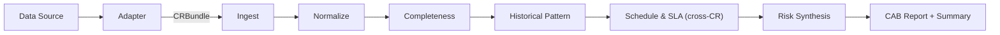

# ITSM Change Request Analyzer — Architecture

## Overview

A sequential pipeline that predicts which IT changes will cause incidents. It analyzes change requests before the Change Advisory Board (CAB) meets, cross-referencing ITSM records, runbooks, rollback plans, CMDB state, SLA definitions, scheduling data, and incident history to produce per-CR risk assessments with approve/conditional/reject recommendations.

**Objective:** Predict change risk and validate predictions against real incident outcomes. The pipeline produces a recommendation; validation requires comparing that recommendation against "did this change actually cause a P1/P2 incident?" See [datasets](docs/datasets.md#predictive-validation-landscape) for current validation status.

**Principle:** minimum capable component — script for deterministic operations, embedding encoder for semantic matching, LLM only where natural-language synthesis is unavoidable. 7 of 9 stages have script or encoder as SOTA.

**Current state:** 6 of 9 stages implemented at L1. Stages 8 and 9 also have L2 (embedding and LLM). Stages 4, 5, 7 skip gracefully when their input artifact is absent. Architecture validated on BPI Challenge 2014 real ITIL data (373 CAB CRs, 50 windows). 147 tests pass. **Predictive accuracy not yet measured** — no dataset with sufficient change→incident outcome labels has been validated. See [evaluation](docs/evaluation.md#predictive-validation).

---

## Pipeline

### Stages



Adapters convert vendor-specific data into `CRBundle` objects (the pipeline's input interface). The pipeline itself is generic — it processes any valid `CRBundle` regardless of origin. Per-CR path runs Ingest → Normalize → Completeness → Historical Pattern → Synthesis. Schedule & SLA runs once per CAB window batch across all CRs, then findings are injected into per-CR reports. Stages 4, 5, 7 are not wired into the runner.

| # | Stage | Purpose | Status |
|---|-------|---------|--------|
| 1 | Ingest | Parse CR bundle (JSON + Markdown) into structured format | L1 implemented |
| 2 | Normalize | Vendor-neutral schema, derived fields (`is_customer_facing`, `affected_tier`) | L1 implemented |
| 3 | Completeness Check | ITIL-required artifact checklist per change type | L1 implemented |
| 4 | Runbook Validation | Cross-reference runbook against CMDB state | Not implemented — skip recorded |
| 5 | Rollback Feasibility | Evaluate rollback plan feasibility | Not implemented — skip recorded |
| 6 | Schedule & SLA | Detect scheduling overlaps across CRs in CAB window (cross-CR) | L1 implemented (overlap-only mode when SLA absent) |
| 7 | Dependency Chain | CMDB service graph ordering violations (cross-CR) | Not implemented — skip recorded |
| 8 | Historical Pattern | Match CR against past incident patterns | L1 + L2 implemented |
| 9 | Risk Synthesis | Aggregate findings into CAB report | L1 + L2 implemented |

Stage 6 is **cross-CR** — it consumes all CRs in a CAB window batch, unlike stages 3/8 which analyze one CR at a time. Stage 7 (designed, not implemented) will also be cross-CR.

### Conditional Execution

Real-world CR bundles omit artifacts. The pipeline skips or degrades instead of failing.

| Stage | Trigger | Behavior |
|:-----:|---------|----------|
| 4 | `runbook` is null | **Not implemented** — skip recorded in `stages_skipped` |
| 5 | `rollback_plan` is null | **Not implemented** — skip recorded |
| 6 | `sla_definitions` is null | **Degrade** to `overlap_only` mode (no tier-breach math) |
| 7 | `cmdb_snapshot` is null | **Not implemented** — skip recorded |

Stages 1-3, 8-9 always run on available fields.

### CAB Recommendation Rules

Deterministic severity rollup (L1). LLM narrative adds cross-dimension reasoning at L2 but does not change the recommendation logic.

| Rule | Condition | Recommendation |
|------|-----------|---------------|
| R1 | Any finding with `severity: blocker` | **Reject** |
| R2 | >= 2 warnings across >= 2 different dimensions | **Conditional** |
| R3 | 1 warning OR only info findings | **Approve** |
| R4 | No findings | **Approve** (clean) |

`risk_level` derived: reject → critical, conditional → high, approve with warnings → medium, approve clean → low.

---

## Input / Output

### CR Bundle (per change request)

| Field | Format | Required |
|-------|--------|----------|
| `itsm_record` | JSON | **yes** |
| `runbook` | Markdown | nullable |
| `rollback_plan` | Markdown | nullable |
| `cmdb_snapshot` | JSON | nullable |
| `sla_definitions` | JSON | nullable |
| `maintenance_schedule` | JSON | nullable |
| `communication_plan` | Markdown | nullable |
| `incident_history` | JSON | nullable |
| `pr_scope_flags` | JSON | nullable |

Only `itsm_record` is required. All other artifacts are optional — their absence triggers stage skips or degraded mode. See `src/cr_analyzer/models/bundle.py` for full Pydantic schema.

### Per-CR Output

- `cab-report.json` — change ID, risk level, recommendation, per-dimension findings array, stages skipped, analysis coverage
- `change-risk-assessment.md` — human-readable report: per-dimension sections with severity badges, evidence citations, remediation

Finding schema: `{dimension, severity [blocker|warning|info], finding, evidence: {artifact, ...}, remediation}`

### Per-Window Output

- `cab-summary.json` — disposition breakdown (approve/conditional/reject counts), cross-CR conflicts, processing time
- `cab-summary.md` — CAB chair summary with top risks and conflict map

### Disk Checkpoints

Each stage writes JSON to the output directory before the next stage starts. Per-CR: `ingest.json`, `normalize.json`, `completeness.json`, `historical-pattern.json`, `cab-report.json`. Per-window: `schedule-sla.json`, `cab-summary.json`, `cab-summary.md`.

---

## Adapter Layer

Adapters sit outside the pipeline. They convert vendor-specific data formats into `CRBundle` objects — the pipeline's input interface. The pipeline never sees the raw data source; it only consumes `CRBundle`.

```
  ┌──────────────────────────────────────────────────┐
  │                 Adapter Layer                     │
  │  ┌──────────────┐  ┌────────────┐  ┌──────────┐ │
  │  │ BPI 2014 CSV │  │ ServiceNow │  │ Fixtures │ │
  │  │ (implemented)│  │  (future)  │  │  (JSON)  │ │
  │  └──────┬───────┘  └──────┬─────┘  └────┬─────┘ │
  └─────────┼─────────────────┼──────────────┼───────┘
            └─────────┬───────┘──────────────┘
                      │ CRBundle (port)
                      ▼
               Pipeline (stages 1-9)
```

**Pattern:** Ports & Adapters. `CRBundle` is the port (interface defined in `src/cr_analyzer/models/bundle.py`). Each adapter is an implementation that knows how to produce `CRBundle` from a specific source.

### Existing: BPI 2014 (`src/cr_analyzer/adapters/bpi2014.py`)

Converts BPI Challenge 2014 CSV exports into `CRBundle` objects:

1. **`load_changes()`** — parses `Detail_Change.csv` (semicolon-delimited). Groups multi-CI rows by Change ID into a single bundle. Maps risk (`Minor Change` → low) and type (`Emergency Change=Y` → emergency).
2. **`load_incident_index()`** — parses `Detail_Incident.csv` into a CI-keyed index of past incidents.
3. **`enrich_bundles_with_incidents()`** — attaches incident history to bundles by matching affected services.
4. **`derive_cab_windows()`** — filters `CAB-approval needed=Y`, groups by ISO week → `dict[week_label, list[CRBundle]]`.

### End-to-end flow

See [docs/pipeline-flow.md](docs/pipeline-flow.md) for a full visual walkthrough of every stage, from raw data through adapter into the pipeline and final CAB report, with BPI 2014 as the concrete example.

### Adding a new data source

Write a new adapter in `src/cr_analyzer/adapters/` that produces `CRBundle` objects. The adapter handles all vendor-specific concerns (field naming, date formats, risk/type mapping, multi-record grouping). The pipeline stays unchanged.

---

## Stage Details

### Stage 1: Ingest

Parse CR bundle artifacts into structured format. JSON artifacts pass through as-is. Markdown runbooks/rollback plans are parsed to extract sections, numbered steps, service references, and commands.

**Level:** L1 (SOTA) — script. Structured input, deterministic parsing.
**Output:** `IngestOutput` — unified CR object with parsed artifacts.

### Stage 2: Normalize

Align fields to vendor-neutral schema. Standardize change types (standard/normal/emergency), risk categories (low/medium/high), timestamps to ISO-8601. Derive `is_customer_facing` from CMDB tier (1-2 = customer-facing). Derive `affected_tier` as min tier across affected services.

**Level:** L1 (SOTA) — script. Finite field mappings.
**Output:** `NormalizeOutput` — canonical CR consumed by all downstream stages.

### Stage 3: Completeness Check

ITIL-required artifact checklist per change type. Rules:
- Normal: requires runbook + rollback + risk category
- Emergency: requires rollback + executive approver
- All: requires change_id, title, description, affected_services, scheduled_window
- Customer-facing (`is_customer_facing=True`): requires communication plan

Missing mandatory artifact = blocker. Missing optional = info. Missing comms for customer-facing = warning.

**Level:** L1 (SOTA) — script rule engine. Deterministic predicate logic.
**Output:** `CompletenessOutput` — findings array + `complete: bool`.

### Stage 4: Runbook Validation (not implemented)

Cross-reference runbook procedures against current CMDB state. Detect stale service references, missing endpoints, version skew.

**Status:** Designed. Skips when `runbook` is null. L1 would use string matching; L2 uses NLP encoder for implicit references; L3 uses LLM for semantic staleness. See [aspirational archive](.harness/archive/docs/ARCHITECTURE-aspirational.md) for evolution levels.

### Stage 5: Rollback Feasibility (not implemented)

Evaluate whether rollback plan is executable given change scope. Detect irreversible changes with naive rollback plans.

**Status:** Designed. Skips when `rollback_plan` is null. See [aspirational archive](.harness/archive/docs/ARCHITECTURE-aspirational.md) for evolution levels.

### Stage 6: Schedule & SLA Analysis

Detect scheduling overlaps across all CRs in a CAB window. For each CR pair, check if `[start, end]` windows overlap on shared `affected_services`.

**Level:** L1 (SOTA) — script. Interval overlap detection (O(n^2) on CR pairs x shared services).
**Degraded mode:** When `sla_definitions` absent, runs in `overlap_only` mode — scheduling conflicts only, no SLA tier-breach math.
**Output:** `ScheduleSlaOutput` — `scheduling_conflicts` array with CR pairs, shared services, overlap window, severity.

### Stage 7: Dependency Chain (not implemented)

Trace CMDB service graph for ordering violations: topological sort, cycle detection, blast radius.

**Status:** Designed. Skips when `cmdb_snapshot` is null. L1 uses DAG algorithms — deterministic and complete. See [aspirational archive](.harness/archive/docs/ARCHITECTURE-aspirational.md).

### Stage 8: Historical Pattern

Match each CR against incident history to surface risk patterns.

**L1 (exact match):** Exact `(service, change_category)` tuple match. Alert when >= 2 past P1/P2 incidents. >= 5 incidents or any P1 → blocker. Evidence includes incident count, dates, root causes.

**L2 (embedding similarity):** Extends L1 with sentence-transformer encoding (all-MiniLM-L6-v2). Cosine similarity matching catches semantically similar patterns with different category names. Configurable threshold (default 0.75). Dual-path mode runs both and deduplicates.

**Fallback:** If `sentence-transformers` not installed, falls back to L1 with warning log.
**Output:** `HistoricalPatternOutput` — findings with `method_used` field (`exact_match` or `embedding_similarity`).

### Stage 9: Risk Synthesis & CAB Report

Aggregate findings from all dimension stages into per-CR risk assessment.

**L1 (template):** Deterministic R1-R4 severity rollup. Template-based Markdown report with per-dimension sections, severity badges, evidence citations. Per-window `CabSummary` with disposition breakdown.

**L2 (LLM narrative):** Selective routing — LLM generates cross-dimension narrative only for `conditional` or `reject` CRs. `approve` CRs use L1 template (cost savings). OpenAI-compatible API with cost tracking and budget ceiling ($2 per 50-CR batch). Graceful fallback to L1 on API error.

**Output:**
- Per-CR: `CabReport` (JSON) + `change-risk-assessment.md`
- Per-window: `CabSummary` (JSON) + `cab-summary.md`

---

## Design Decisions

### Sequential Pipeline

Why not alternatives:
- **vs fan-out:** Stages 3-5 could run in parallel, but complexity isn't justified at 50-CR scale (< 5 min at L1).
- **vs monolithic:** A single "analyze everything" stage bundles 8 reasoning dimensions into one unmeasurable component. Per-stage separation enables per-dimension metrics and independent evolution.
- **vs iterative:** Each CR is a single pass. No re-reading artifacts after seeing other stage results. Stages ordered by dependency: Completeness catches missing artifacts before Runbook/Rollback try to parse them.

Pipeline structure (stage interfaces, JSON checkpoints) is identical at L1 and SOTA — only stage implementations change.

### Minimum Capable Component

| Stage | Level where LLM enters | Why cheaper alternatives fail |
|-------|----------------------|------------------------------|
| Runbook Validation | L3 (not implemented) | NLP encoder (L2) extracts service references, but prose-embedded implicit references ("deploy to the gateway that handles card transactions") require language understanding. |
| Rollback Feasibility | L3 (not implemented) | Temporal reasoning ("revert Tuesday's backup" when change runs Thursday-Saturday) requires understanding interaction between scope and procedure. |
| Risk Synthesis | L2 (implemented) | Template reports list findings per dimension. CAB chairs need cross-dimension reasoning ("runbook staleness + rollback depends on same deprecated service"). Only stage where LLM is SOTA. |

**7 of 9 stages** have script or encoder as SOTA. No LLM needed.

### Cost Ceiling

Per-batch budget: **< $2** for a 50-CR CAB window.

- L1 (all script): $0
- L2 Risk Synthesis: selective routing — LLM only for conditional/reject CRs (~40% of batch). Typical cost: $0.40-1.60 per batch. If conditional+reject rate exceeds 50%, token cap (300 tokens/CR) keeps within budget.

### Complementarity with #4.5

The ITSM CR Analyzer and Change Window Risk Analyzer (#4.5) are complementary:

| Dimension | This project (#19b) | #4.5 Change Window Risk |
|-----------|---------------------|------------------------|
| Core question | "Is the operational plan sound?" | "Will code changes break each other?" |
| Inputs | ITSM record, runbook, rollback, CMDB, SLA, schedule | PR diffs, API schemas, CI/CD configs |
| Code analysis | None (scope flags only) | Full diff semantic analysis |

If both experiments mature, a shared "CAB window context" schema bridges them. `pr_scope_flags` is reserved in the CR Bundle for this integration.

---

## Experiment Context

This pipeline is **experiment #19b** in a long-running agent research program. The experiment validates whether harness engineering — checkpoints, stage gates, evolution levels, adversarial verification — produces reliable overnight agents for enterprise operations.

**Agent fit:** 23/25 (H=5, O=5, E=5, N=4, C=4). 8 heterogeneous artifact types requiring cross-source reasoning. Overnight exhaustive coverage of 20-50 CRs per CAB window.

**Validation status:** P0 (architecture) done via BPI 2014. P1 (predictive) in progress via ApacheJIT. P2 (full pipeline with prose artifacts) requires enterprise partner.

**Minimum capable component** governs evolution: each stage starts at the cheapest level that works (script), advancing to encoder or LLM only when measured recall drops below threshold. 7 of 9 stages have script or encoder as SOTA.

Full research lineage, H/O/E/N/C scoring rationale, harness component mapping, and validation phase details: [docs/experiment-context.md](docs/experiment-context.md). P0 success gates and evolution advancement protocol: [archived aspirational content](.harness/archive/docs/ARCHITECTURE-aspirational.md).

---

## Constraints

| Constraint | Detail |
|------------|--------|
| Real-first + synthetic regression | BPI 2014 real ITIL data is primary. Synthetic fixtures (`fixtures/cab-window-01/`) are regression tests. No production ITSM data. |
| No external ITSM API | Vendor-neutral JSON schema. No ServiceNow/BMC/Jira SM integration at P0. |
| Enterprise partner required for P2 | Real-path validation (FP rate on real CRs, CAB alignment vs expert) requires partnership. |

## Active Known Unknowns

| # | Unknown | Impact | Resolution |
|---|---------|--------|------------|
| 1 | Conditional-approval GT ambiguity | R1-R4 rules are deterministic but real CABs apply judgment. | Accept rules for P0 architecture validation. Calibrate with expert data at P2. |
| 2 | Zero prose-stage validation | Stages 4/5 (runbook/rollback) have no real data. | Blocked until enterprise partner provides CRs with prose artifacts. |
| 3 | English/ITIL-only scope | No multi-language or non-ITIL framework support. | P0 limitation. Evaluate at P2 based on partner requirements. |

For resolved unknowns and aspirational content, see [.harness/archive/docs/ARCHITECTURE-aspirational.md](.harness/archive/docs/ARCHITECTURE-aspirational.md).

---

**Related docs:** [Experiment Context](docs/experiment-context.md) | [Pipeline Flow](docs/pipeline-flow.md) | [Glossary](docs/glossary.md) | [Datasets](docs/datasets.md) | [Evaluation](docs/evaluation.md) | [Archived aspirational content](.harness/archive/docs/ARCHITECTURE-aspirational.md)
