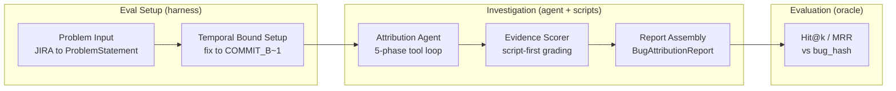
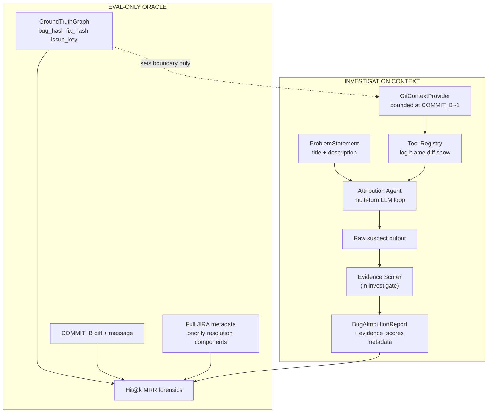

# Architecture — Bug Attribution Harness (V3)

A closed-loop bug attribution system: a deterministic harness controls temporal boundaries, tool access, and cost; a multi-turn LLM agent searches git history to rank suspect commits; script stages verify evidence grounding; evaluation scores ranked suspects against oracle `bug_hash`.

## What This System Is

Given a reported problem (JIRA title + description) and a temporally bounded repository snapshot, the agent identifies which commit most likely **introduced** the defect. The harness enforces what the agent can see, how many git queries it may run, and how evidence is graded before a report is emitted.

**V2 → V3 pivot:** V2 asked "Is this commit risky?" given one commit's diff. V3 asks "Which commit caused this bug?" given a problem report and repository-wide git search up to (but not including) the fix commit.

## Design Philosophy: LLM Reasons, Scripts Verify

| Responsibility | LLM (Attribution Agent) | Scripts (Harness) |
|----------------|-------------------------|-------------------|
| Parse problem, extract signals | Yes | — |
| Choose search strategy | Yes | — |
| Execute git queries | Invokes tools | Tool dispatch + boundary enforcement |
| Select candidate commits | Yes | — |
| Attribute mechanism | Yes | — |
| Verify evidence quotes | — | **Evidence Scorer** |
| Enforce temporal git boundary | — | **GitContextProvider** |
| Track cost / stop on budget | — | **BudgetState** |

## Pipeline

**Eval setup** (not part of the agent's runtime):

| Stage | Owner | Input | Output |
|-------|-------|-------|--------|
| Problem Input | Eval harness | JIRA `title` + `description` | `ProblemStatement` |
| Temporal Bound | Eval harness | `fix_hash` from eval oracle | `GitContextProvider` bounded at `COMMIT_B~1` |

`ProblemExtractor` builds a `ProblemStatement` from a JIRA ticket. This connects the problem description with ground truth for evaluation. The agent never sees how the `ProblemStatement` was constructed.

**Investigation pipeline** (the agent's runtime):

| Stage | Owner | Input | Output |
|-------|-------|-------|--------|
| 1. Attribution Agent | LLM + tools | `ProblemStatement` + bounded git | Raw suspect list + reasoning |
| 2. Evidence Scorer | Script (in `investigate()`) | Suspects + diffs | Per-suspect grounding scores in metadata |
| 3. Report Assembly | Script (in `investigate()`) | Scored suspects | `BugAttributionReport` (rank/confidence unchanged) |

Stages 2–3 execute inside `AgentOrchestrator.investigate()` before the report is returned. Eval harness calls `evaluate_attribution()`, which reuses attached `metadata["evidence_scores"]` for D6 metrics instead of re-fetching diffs.

## Trust Boundaries

### Investigation context (agent-visible)

| Source | Provides |
|--------|----------|
| JIRA title + description | Bug symptoms, repro steps, stack traces |
| Git log (pre-fix) | Commit history, messages, authors |
| Git blame (pre-fix) | Line-level introduction history |
| Git diff / show (pre-fix) | Patch content for suspect commits |

### Eval-only (never enters agent context)

| Source | Used for |
|--------|----------|
| `bug_hash` | Hit@k, MRR ground truth |
| `fix_hash` / `COMMIT_B` | Temporal boundary setup; fix diff for forensics |
| JIRA priority, resolution, components | Extended eval rubrics (future) |

## Cost Budget

Per-investigation limits enforced by `BudgetState`:

| Resource | Limit | On exceed |
|----------|-------|-----------|
| Tool calls | 30 | Force conclude |
| Tokens | 100,000 | Force conclude |
| Cost | $0.50 USD | Force conclude |

## Related

| Document | Purpose |
|----------|---------|
| [temporal-model.md](temporal-model.md) | Temporal boundary rules |
| [agent-loop.md](agent-loop.md) | Attribution agent phases, tool catalog |
| [evaluation.md](evaluation.md) | Hit@k, MRR rubrics, acceptance thresholds |
| [datasets.md](datasets.md) | ApacheJIT ground truth chain |
| [glossary.md](glossary.md) | Project-specific terms |
